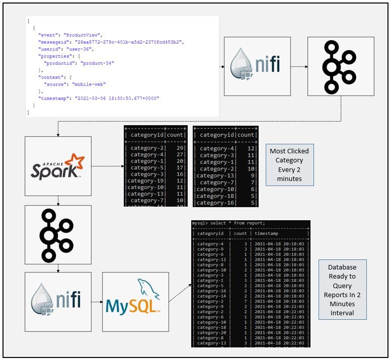
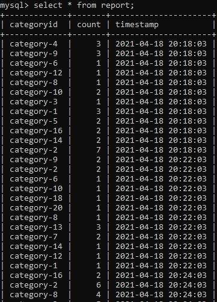

# SparkStream E-commerce Hourly Most Clicked Product Category
### Dataflow Pipeline


### Summary

In this application we used 30.000 order data and simulate those data as 1 transaction each second using apache kafka and apache nifi. Apache nifi used to transform raw data to make data ready for analysis. SparkStream api used to perform necessary transformations. Raw data contains product type and excel dictionary "product-category-map.csv" used to convert product column to category column. Results aggregated each hour and printed to consele for visualization. Same data consumed by another kafka topic to send it to the MYSQL database through apache nifi for further query and reporting. Normally NOSQL database must be used for horizontal scaleability but in this project mysql has been chosen to demonstrate apache nifi-mysql server integration.

### Task List

- [x] Check raw json data using https://jsoneditoronline.org/


- [x] Create nifi pipeline


- [x] Create kafka topic
- [x] Create spark session and define schema
```
spark = SparkSession \
      .builder \
      .appName("Tumbling Window Stream") \
      .master("local[3]") \
      .config("spark.streaming.stopGracefullyOnShutdown", "true") \
      .config("spark.sql.shuffle.partitions", 2) \
      .getOrCreate()

#Describe schema (userid and productid will be enough to find most viewed category)
  schema = StructType([
  StructField("userid", StringType()),
  StructField("properties", StructType([
      StructField("productid", StringType())
  ])),
  StructField("timestamp", StringType())
])
```
- [x] Read data from kafka topic
```
#Read data from kafka topic
    kafka_df = spark.readStream \
        .format("kafka") \
        .option("kafka.bootstrap.servers", "localhost:9092") \
        .option("subscribe", "view2") \
        .option("startingOffsets", "earliest") \
        .load()
```
- [x] Deserialization and transformations of data
```
#Data in kafka topic have key-value format, from_json is used to deserialize json value from string
    value_df = kafka_df.select(from_json(col("value").cast("string"), schema).alias("value"))
#Checking schema if everything is correct
    value_df.printSchema()
#Explode dataframe to remove sub-structures
    explode_df = value_df.selectExpr("value.userid", "value.properties.productid",
                                     "value.timestamp")
#Checking schema if everything is correct
    explode_df.printSchema()
#Set timeParserPolicy=Legacy to parse timestamp in given format
    spark.sql("set spark.sql.legacy.timeParserPolicy=LEGACY")
#Convert string type to timestamp
    transformed_df = explode_df.select("userid", "productid", "timestamp") \
        .withColumn("timestamp", to_timestamp(col("timestamp"), "yyyy-MM-dd HH:mm:ss")) \

#Checcking schema if everything is correct
    transformed_df.printSchema()
```
- [x] Create 1 hour window
```
#Create 1 hour window
#Create watermark to autoclean history
#Groupby product_id and count considering distinct users
#Rename new column as count
    window_count_df = transformed_df \
        .withWatermark("timestamp", "2 minutes") \
        .groupBy(col("productid"),
            window(col("timestamp"),"2 minutes")) \
            .agg(approx_count_distinct("userid").alias("count"))
```
- [x] Convert productid column with categoryid column
```
#Select everything from dataframe and sort by highest to lowest count rate
    output_df = window_count_df.select("*")
    output_df.printSchema()
#Import category - product ID csv file
    dict_df = spark.read.csv('C:/Users/PC/Documents/Jupyter/Job_Interview_Cases/Hepsiburada/Unzip/data/product-category-map.csv')
#Create dictionary from dataframe
    dict = dict_df.select('_c0', '_c1').rdd.collectAsMap()
#Map current dataframe with created dictionary to replace product_id with category name
    output_df = output_df.na.replace(dict, 1)
#Rename product_id column to category id
    output_df = output_df.withColumnRenamed("productid","categoryid")
```
- [x] Create 2 foreach batch function to perform aggregations and write data into kafka topic and console
```
#Define foreach batch function to aggrate stream data several times and sink to csv file
def foreach_batch_func(df, epoch_id):
    df = df.groupBy(col("categoryid")).sum("count")
    df = df.withColumnRenamed("sum(count)","count")
    df = df.sort(desc("count"))
    #Prepare serialized kafka values
    kafka_df = df.select("*")
    #Choose columns
    kafka_df = kafka_df.selectExpr("*")

    kafka_target_df = kafka_df.selectExpr("categoryid as key",
                                                     "to_json(struct(*)) as value")
    kafka_target_df.coalesce(1) \
        .write \
        .format("kafka") \
        .option("header","true") \
        .option("kafka.bootstrap.servers", "localhost:9092") \
        .option("topic", "view3") \
        .save()
    pass
#Coalesce(1) prevent csv file partitioning


#Define foreach batch function to aggrate stream data several times and print console
def foreach_batch_func2(df, epoch_id):
    df = df.groupBy(col("categoryid")).sum("count")
    df = df.withColumnRenamed("sum(count)","count")
    df = df.sort(desc("count"))
    df \
        .write.format("console") \
        .save()
    pass
```
- [x] Write data into console and kafka topic
```
#Write spark stream to console or csv sink
    window_query = output_df.writeStream \
    .foreachBatch(lambda df, epoch_id: foreach_batch_func(df, epoch_id))\
    .outputMode("append") \
    .trigger(processingTime="2 minutes") \
    .start()

#Write spark stream to console or csv sink
    window_query_2 = output_df.writeStream \
    .foreachBatch(lambda df, epoch_id: foreach_batch_func2(df, epoch_id))\
    .outputMode("append") \
    .option("format","append") \
    .option("path","C:/Users/PC/Documents/Jupyter/Job_Interview_Cases/Hepsiburada/Unzip/data/") \
    .trigger(processingTime="2 minutes") \
    .start()

    window_query.awaitTermination()
```
- [x] Check the results to find most clicked categories


- [x] Create mysql database and establish connection between mysql and apache nifi
- [x] Send data to mysql



### Code Description

Product_View_Pipeline.xml is nifi pipeline to simulate dataflow and perform ETL operations as well as sending data to mysql server.

nifi_spark_kafka_product_view.py is spark streaming code for data processing, analysis and sink operation.


### Running

1. Start zookeeper (Check kafka scripts)

```
zookeeper-server-start.bat config\zookeeper.properties (zookeeper-server-start.sh for linux)
```

2. Start kafka (Check kafka scripts)
```
kafka-server-start.bat config\server.properties  (kafka-server-start.sh for linux)
```

3. Start nifi and processors

4. Execute below code

```
spark-submit --packages org.apache.spark:spark-sql-kafka-0-10_2.12:3.0.1 nifi_spark_kafka_product_view.py
```
5. Start mysql server

6. Check results
